# Enterprisey Apps — Data Pipeline Platform

A micro-frontend monorepo demonstrating a **data pipeline architecture** built with Angular 21, NestJS 11, NgRx, and Nx Module Federation. The platform models four interconnected domains — Ingress, Transformation, Reporting, and Export — each with distinct state management strategies and UI patterns.

## Architecture Overview

```mermaid
flowchart TB
    subgraph Shell["Dashboard Shell :4200"]
        Router[Router]
        FeaturesState[Features State]
    end

    subgraph MicroFrontends["Micro-Frontends (Module Federation)"]
        direction LR
        Ingress["🟢 Ingress\n:4202"]
        Transform["🟡 Transformation\n:4203"]
        Report["🔵 Reporting\n:4204"]
        Export["🔴 Export\n:4205"]
        Users["⚫ Users\n:4201"]
    end

    subgraph APIs["NestJS APIs"]
        direction LR
        FeaturesAPI["Features API\n:3000"]
        IngressAPI["Ingress API\n:3100"]
        TransformAPI["Transform API\n:3200"]
        ReportAPI["Reporting API\n:3300"]
        ExportAPI["Export API\n:3400"]
        UsersAPI["Users API\n:3500"]
    end

    subgraph SharedLibs["Shared Libraries"]
        direction LR
        ApiInterfaces[api-interfaces]
        StateLibs[domain-state libs]
        DataLibs[domain-data libs]
        UITheme[ui-theme]
        Guards[guards]
    end

    subgraph Storage["SQLite Databases"]
        direction LR
        DB1[(features.db)]
        DB2[(ingress.db)]
        DB3[(transform.db)]
        DB4[(reporting.db)]
        DB5[(export.db)]
        DB6[(users.db)]
    end

    %% Shell connections
    Router -->|"loadRemoteModule()"| MicroFrontends
    FeaturesState -->|HTTP| FeaturesAPI

    %% Frontend to API connections
    Ingress -->|HTTP| IngressAPI
    Transform -->|HTTP| TransformAPI
    Report -->|HTTP| ReportAPI
    Export -->|HTTP| ExportAPI
    Users -->|HTTP| UsersAPI

    %% API to DB connections
    FeaturesAPI --> DB1
    IngressAPI --> DB2
    TransformAPI --> DB3
    ReportAPI --> DB4
    ExportAPI --> DB5
    UsersAPI --> DB6

    %% Cross-domain data flow
    IngressAPI -.->|"schema"| TransformAPI
    TransformAPI -.->|"pipeline"| ReportAPI
    ReportAPI -.->|"query"| ExportAPI

    %% Shared libs usage
    SharedLibs -.-> MicroFrontends
    SharedLibs -.-> APIs
```



### Data Flow


The dashboard shell dynamically loads each domain as a Module Federation remote, registered through a features API. Each domain has its own NestJS backend with SQLite persistence and its own Angular frontend with dedicated state management.

### State Management Strategy

| Domain | State Approach | Why |
|--------|---------------|-----|
| **Ingress** | NgRx classic store + functional effects | WebSocket-like effects for live status; action log for debugging connection issues |
| **Transformation** | NgRx classic store + complex selectors | Pipeline preview requires composing selectors across steps; action replay for debugging |
| **Reporting** | NgRx signalStore (`@ngrx/signals`) | Local filter state per widget; simpler than classic store for read-heavy UI |
| **Export** | NgRx signalStore (`@ngrx/signals`) | Job list with polling; `withMethods` for start/cancel/retry |
| **Users** | NgRx classic store | Existing auth flow, kept as-is |
| **Features** | NgRx classic store | Existing feature registry, kept as-is |

## Setup

```bash
git clone https://github.com/onehungrymind/enterprisey-apps.git
cd enterprisey-apps
npm install
```

### Port Assignments

| Service | Port | Type |
|---------|------|------|
| Dashboard (shell) | 4200 | Frontend host |
| Users | 4201 | Frontend MF remote |
| Ingress | 4202 | Frontend MF remote |
| Transformation | 4203 | Frontend MF remote |
| Reporting | 4204 | Frontend MF remote |
| Export | 4205 | Frontend MF remote |
| Features API | 3000 | NestJS backend |
| Ingress API | 3100 | NestJS backend |
| Transformation API | 3200 | NestJS backend |
| Reporting API | 3300 | NestJS backend |
| Export API | 3400 | NestJS backend |
| Users API | 3500 | NestJS backend |
| Portal | 4800 | Standalone frontend |
| Wizard | 4900 | Standalone frontend |
| Envoy Gateway | 9000 | API Gateway |

### Running Locally

Quick start (dashboard + features API):

```bash
npm start
```

Or start a domain with its backend:

```bash
npm run serve:ingress:full        # Ingress API + frontend
npm run serve:transformation:full # Transformation API + frontend
npm run serve:reporting:full      # Reporting API + frontend
npm run serve:export:full         # Export API + frontend
npm run serve:users:full          # Users API + frontend
npm run serve:portal:full         # Features API + Portal admin
```

Individual services:

```bash
# Frontends
npm run serve:dashboard
npm run serve:ingress
npm run serve:transformation
npm run serve:reporting
npm run serve:export
npm run serve:users
npm run serve:portal

# Backends
npm run serve:features-api
npm run serve:ingress-api
npm run serve:transformation-api
npm run serve:reporting-api
npm run serve:export-api
npm run serve:users-api
```

### Docker

Build and run the full stack:

```bash
npm run docker:build    # Build all service images
npm run docker:up       # Start with docker-compose
npm run docker:down     # Stop all containers
```

The cluster will be available at `http://localhost:9000` via Envoy gateway.

### PM2 (Process Manager)

Run all services with a single command, managed by PM2:

```bash
npm install -g pm2        # First time only

npm run pm2:start         # Start all 12 services
npm run pm2:status        # View process status table
npm run pm2:logs          # Aggregated logs (color-coded)
npm run pm2:stop          # Stop all services
npm run pm2:delete        # Remove all from PM2
```

Start only specific services:

```bash
pm2 start ecosystem.config.js --only features-api,dashboard,ingress-api,ingress
```

PM2 provides auto-restart on crash, aggregated logs, and easy process management. See `ecosystem.config.js` for the full configuration.

### E2E Tests (Playwright + Cucumber BDD)

```bash
npx playwright install    # First time only
npm run e2e               # Run all tests
npm run e2e:headed        # Run with browser visible
npm run e2e:ui            # Run with Playwright UI
```

Feature files are in `e2e/features/`.

### Seed Data

Populate all databases with sample data:

```bash
npm run seed              # Seed all databases
npm run seed:ingress      # Seed only ingress
```

## Project Structure

```
apps/
  dashboard/          # Shell host app (port 4200)
  ingress/            # Data source management MF remote
  transformation/     # Pipeline builder MF remote
  reporting/          # Dashboard & visualization MF remote
  export/             # Job queue MF remote
  users/              # User management MF remote
  portal/             # Admin portal (standalone)

apis/
  features/           # Features registry API (port 3000)
  ingress/            # Ingress API (port 3100)
  transformation/     # Transformation API (port 3200)
  reporting/          # Reporting API (port 3300)
  export/             # Export API (port 3400)
  users/              # Users & auth API (port 3500)

libs/
  api-interfaces/     # Shared TypeScript interfaces for all domains
  environment/        # Runtime config injection (APP_ENVIRONMENT token)
  material/           # Angular Material re-exports
  testing/            # Mock data for all domains
  guards/             # JWT + Roles guards for NestJS backends
  ui-login/           # Shared login component
  ingress-data/       # Ingress HTTP services
  ingress-state/      # Ingress NgRx classic store
  transformation-data/# Transformation HTTP services
  transformation-state/# Transformation NgRx classic store
  reporting-data/     # Reporting HTTP services
  reporting-state/    # Reporting NgRx signalStore
  export-data/        # Export HTTP services
  export-state/       # Export NgRx signalStore
  users-data/         # Users HTTP services
  users-state/        # Users NgRx classic store
  features-data/      # Features HTTP services
  features-state/     # Features NgRx classic store

e2e/
  features/           # Gherkin BDD feature files
  steps/              # Step definitions
  fixtures/           # Shared test fixtures
  playwright.config.ts

tooling/
  wizard/             # Code generation wizard
```

## Domain Models

### Ingress — Data Source Management
Manage external data source connections with real-time status tracking, connection testing, and schema discovery.

### Transformation — Pipeline Builder
Build multi-step data transformation pipelines with drag-and-drop step reordering, schema preview propagation, and execution history.

### Reporting — Dashboards & Visualization
Create dashboards with configurable widgets (tables, charts, metrics), backed by report queries with mock aggregation.

### Export — Job Queue
Queue and monitor export jobs with progress tracking, format selection (CSV/JSON/XLSX/PDF), and automatic polling.

## Authentication

The Users API handles authentication with JWT tokens.

```bash
# Create a user
curl -X POST http://localhost:3500/api/users \
  -H "Content-Type: application/json" \
  -d '{"firstName":"test","lastName":"user","email":"test@test.com","password":"test","role":"admin","company_id":"test"}'

# Log in
curl -X POST http://localhost:3500/api/users/auth/login \
  -H "Content-Type: application/json" \
  -d '{"email":"test@test.com","password":"test"}'
```

All backend controllers are guarded with `JwtAuthGuard` and `RolesGuard`.

## Progress Checklist

### Done

- [x] **Phase 1a** — Remove old domains (challenges, flashcards, notes apps/libs/backends)
- [x] **Phase 1b** — Replace Cypress with Playwright + playwright-bdd (6 Gherkin feature files)
- [x] **Phase 1c** — Create `libs/environment/` with `APP_ENVIRONMENT` injection token
- [x] **Phase 1d** — Update `libs/api-interfaces/` and `libs/testing/` with new domain models
- [x] **Phase 2** — Ingress domain end-to-end (backend, data lib, state lib, frontend app)
- [x] **Phase 3** — Transformation domain end-to-end (backend, data lib, state lib, frontend app)
- [x] **Phase 4** — Reporting domain end-to-end (backend, data lib, signalStore, frontend app)
- [x] **Phase 5** — Export domain end-to-end (backend, data lib, signalStore, frontend app)
- [x] **Phase 6** — Integration: dashboard home, viewTransitions, features registry, docker/envoy config
- [x] **Phase 7** — Modernize existing code: environment injection in features-data, users-data, portal, users apps
- [x] **Build fixes** — All 16 projects build (`nx run-many --target=build --all`)
- [x] **Runtime fixes** — Switch to `better-sqlite3` and `bcryptjs` for Node 22 compatibility
- [x] **All 6 backends start** — Verified NestJS bootstrap on correct ports

### Remaining

- [ ] **Seed data** — Run database seeders for all backends so the UI has data to display on first load
- [ ] **Smoke test** — Start all services together, navigate through all domains in the dashboard
- [ ] **Cross-domain inter-service calls** — Transformation fetching schemas from Ingress, Reporting from Transformation, Export from Reporting
- [ ] **Role-based access** — Define admin/analyst/engineer role permissions on backend controllers
- [ ] **Login component** — Migrate `libs/ui-login/` from `[(ngModel)]` to Signal Forms
- [ ] **Users app** — Migrate user detail/list to modern component patterns
- [ ] **Wizard** — Update schema list and templates for new domain names
- [ ] **Playwright step definitions** — Implement step definitions for all 6 `.feature` files
- [ ] **Unit tests** — Add test coverage for stores, services, effects, selectors
- [ ] **Advanced UI** — `httpResource()` for widget data, `linkedSignal` for filter state, `@defer` for chart widgets
- [ ] **WebSocket support** — Real-time source status in Ingress (currently simulated)
- [ ] **Pipeline DAG editor** — Visual drag-and-drop pipeline builder in Transformation
- [ ] **Dashboard layout editor** — Drag-and-drop widget positioning in Reporting
- [ ] **ESLint 9** — Migrate from ESLint 8 legacy config to flat config
- [ ] **CI/CD** — Pipeline configuration for build, test, and deployment
- [ ] **Health checks** — Add health endpoints to all backends

## Tech Stack

| Layer | Technology | Version |
|-------|-----------|---------|
| Monorepo | Nx | 22 |
| Frontend | Angular | 21 |
| Backend | NestJS | 11 |
| State (classic) | NgRx Store/Effects/Entity | 21 |
| State (signal) | NgRx Signals | 21 |
| Database | SQLite via better-sqlite3 + TypeORM | - |
| Auth | JWT (passport-jwt) + bcryptjs | - |
| UI Components | Angular Material | 21 |
| Micro-frontends | Nx Module Federation | 22 |
| E2E Testing | Playwright + playwright-bdd | - |
| API Gateway | Envoy | - |
| Containerization | Docker + Docker Compose | - |
